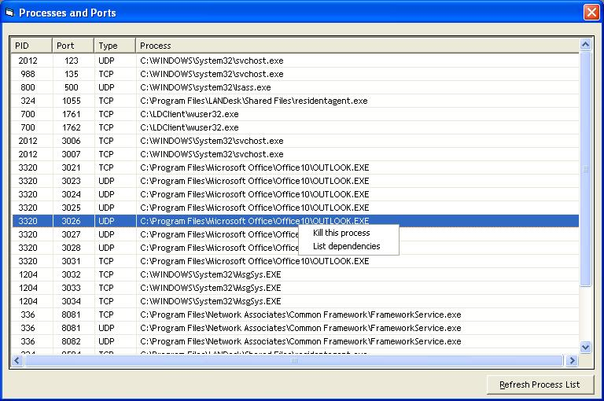



## Process And Ports

### Description

List all process and TCPIP used / open ports with a killing process and list dependencies files for process.

Right click on a process to kill or list dependencies...

This is a LUPRIX's code evolution / modification.

Thanks to LUPRIX and SNYTAX for the dependencies file's code.
 
### More Info
 

             |
---                |---
**Submitted On**   |2004-08-18 15:58:32
**By**             |[Alain GUERIN](https://github.com/Planet-Source-Code/PSCIndex/blob/master/ByAuthor/alain-guerin.md)
**Level**          |Intermediate
**User Rating**    |5.0 (15 globes from 3 users)
**Compatibility**  |VB 5\.0, VB 6\.0
**Category**       |[Windows API Call/ Explanation](https://github.com/Planet-Source-Code/PSCIndex/blob/master/ByCategory/windows-api-call-explanation__1-39.md)
**World**          |[Visual Basic](https://github.com/Planet-Source-Code/PSCIndex/blob/master/ByWorld/visual-basic.md)
**Archive File**   |[Process\_An1783288182004\.zip](https://github.com/Planet-Source-Code/alain-guerin-process-and-ports__1-55663/archive/master.zip)

### API Declarations

See source code

